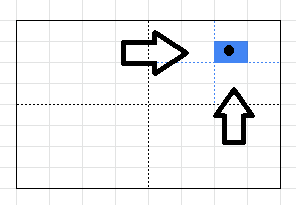
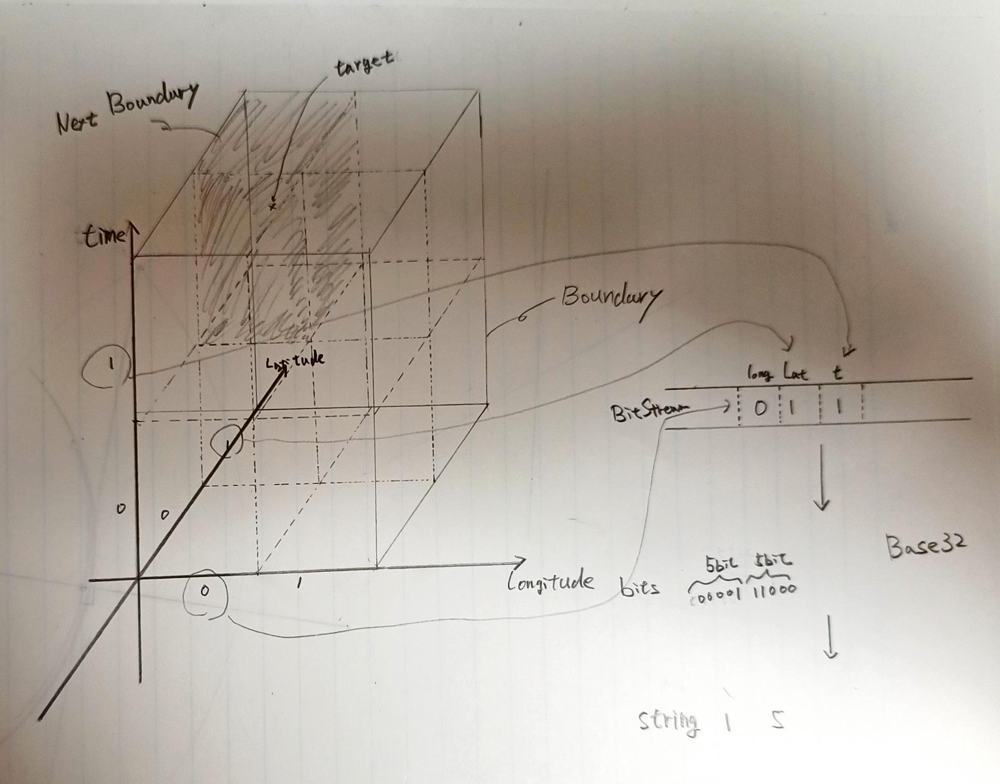

# VectorHashEncoder

[](https://github.com/kazumatu981/VectorHashEncoder/actions/workflows/codeql.yml)
[](https://github.com/kazumatu981/VectorHashEncoder/actions/workflows/dotnet.yml)

## Basic Idea

`VectorHashEncoder`は、Gustavo Niemeyer氏により開発されpublic domainで公開されている [Geohash](http://geohash.org/)の一般化実装である。
.Net 6.0向けクラスライブラリとして実装している。

Geohashは、2次元の数値(浮動小数点)を文字列化することで、近傍の判定や近傍の検索を高速に行うことができる優れたエンコード方式である。
本ライブラリが目指した一般化は「次元の追加」と「時間の追加」である。

### 次元の追加

Gustavo Niemeyer氏が提唱した通り、エンコード化したい対象を含む区間(矩形)を2^n分割しながら区間を縮める。
縮めた区間には、`0/1`を次元に割り当てて、bitstreamを作成して、Base32エンコード(文字列化)する。




Geohashは、緯度/経度によるエンコードであるのに対して、このライブラリでは、区間を自由に設定できる。
例えば、100m * 50m * 20mの建物, 10km四方と上空100mの空間のような指定ができる。 
このように、一般的な区間に変更できるように拡張したことで、以下のような空間情報の分野に応用できることを想定した。

* フロア内の区画やフロア数など、屋内の位置情報
* 電線や水道菅といった、空中や地中の位置情報
* ドローン飛行エリア内の情報

また、本ライブラリでは、`n=2`の場合Geohashと互換性がとれるよう、Base32エンコードを採用している。
さらに汎用性を高めるために、エンコードに用いる文字種やエンコード化する場合のビット数を変更できるように実装した。

### 時間の追加

上記「次元の追加」において、最後の空間軸を時間軸と解釈する。
その日の`00:00`からの経過ミリ秒を最後の軸とし、`n=3`のハッシュ値をとるように実装した。



### 既知の実装との関係

.NetクラスライブラリのGeoHashの実装はすでに、
[geohash-dotnet](https://www.nuget.org/packages/geohash-dotnet)や[NGeoHash](https://www.nuget.org/packages/NGeoHash)が確認できている。
これらは、デコード機能や近傍のコードを算出する機能があり、そのような機能が必要な場合はそちらを使っていただきたい。

## Usage

### GeoHashEncoder

```CSharp

// 変換対象
var location = new GeoLocation()
{
    Longitude = 140.839062,
    Latitude = 38.258944, 
}

// エンコーダのインスタンス化
var encoder = new GeoHashEncoder();

// Geohash化
var actual = encoder.EncodeToString(location, 8);

// Geohashと互換性がとれるはず
//  see: https://geohash.tools/
Assert.Equal("xnu1sugf", actual);

```

### TimeSpaceHashEncoder

### PrimitiveHashEncoder

## Link

* [Wikipedia ja ジオハッシュ](https://ja.wikipedia.org/wiki/%E3%82%B8%E3%82%AA%E3%83%8F%E3%83%83%E3%82%B7%E3%83%A5)
* [Wikipedia en Geohash](https://en.wikipedia.org/wiki/Geohash)
